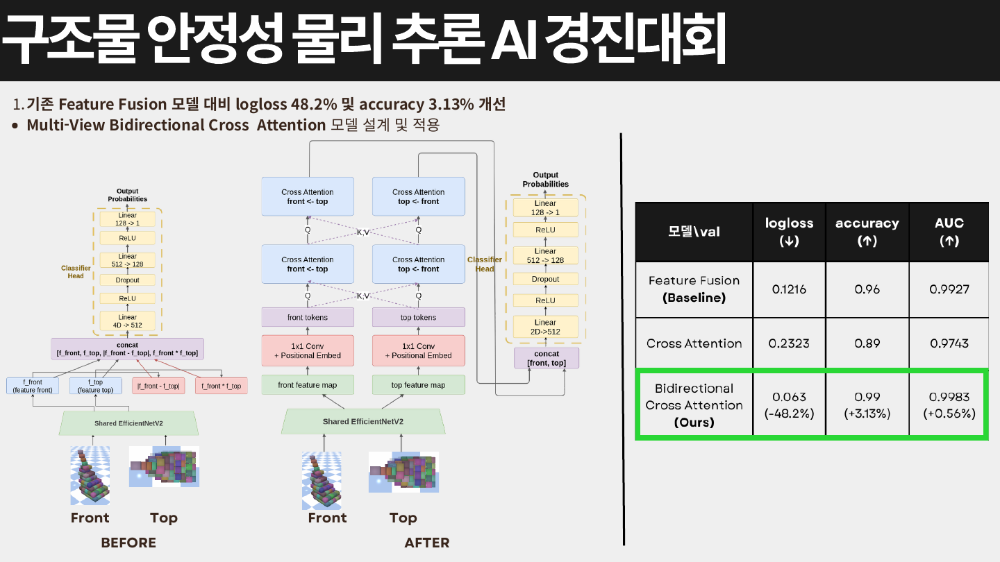
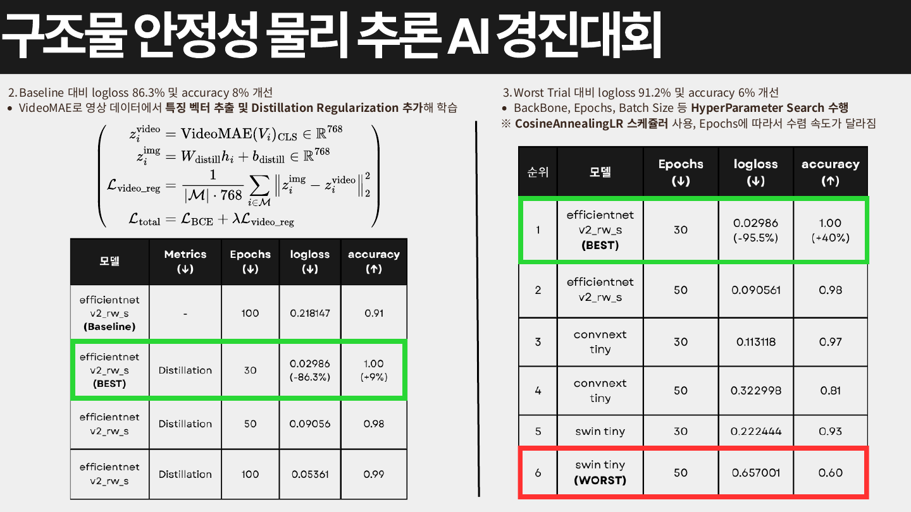

# Structure Stability Challenge

[한국어](README.ko.md) | [English](README.en.md)

데이콘이 주관한 구조물 안정성 예측 경진대회의 솔루션 코드입니다 (66th/484 Teams) <br>

## 대회 설명
참가자는 구조물에 대해 제공되는 2가지 시점의 이미지 데이터를 입력으로 활용하여, 시뮬레이션 시작 10초 동안 구조물이 불안정(unstable) 상태로 전환될 확률과 안정(stable) 상태를 유지할 확률을 예측하는 AI 모델을 개발해야 합니다.

<details>
<summary><strong>[1] 데이터 라벨</strong></summary>

샘플의 라벨(Label)은 물리 시뮬레이션 결과를 기반으로 다음과 같이 정의됩니다.

| 라벨 | 정의 |
|------|------|
| 안정(stable) | 시뮬레이션 시작 후 10초 동안 구조물에 의미 있는 이동이나 변형이 발생하지 않은 경우 |
| 불안정(unstable) | 시뮬레이션 시작 후 10초 이내에 누적 이동 거리가 1.5cm 이상 발생하거나 구조적 붕괴가 나타난 경우 |

일부 샘플들은 외형만으로 안정 여부를 구분하기 어려운 경계(Boundary) 특성을 가지도록 구성되어 있어, **시각 정보 기반의 정밀한 물리 추론**이 요구됩니다.

이에 따라 구조물의 물리 변화 과정을 참고할 수 있도록, **학습 데이터(train)에는 10초 분량의 시뮬레이션 영상**이 함께 제공됩니다.

</details>

<details>
<summary><strong>[2] 데이터셋 구성 및 학습 전략</strong></summary>

본 대회는 정제된 환경에서 학습한 모델이 <strong>변동성이 큰 실제 환경에서 얼마나 강건하게 작동하는지</strong> 평가합니다.

| 데이터 | 샘플 수 | 환경 | 활용 목적 |
|--------|---------|------|-----------|
| 학습 데이터(train) | 1,000개 | 광원 및 카메라 좌표가 고정된 실험실 환경 | 기본적인 물리 법칙과 구조적 특징 학습 |
| 개발 데이터(dev) | 100개 | 광원 및 카메라 좌표가 무작위로 변동하는 실제 평가 환경과 동일한 설정 | 평가 환경에 대한 모델의 적응력 검증 |
| 평가 데이터(test) | 1,000개 | 개발 데이터와 동일한 무작위 환경 설정 | 최종 순위 결정을 위한 평가 |

참가자는 학습 데이터(train)와 개발 데이터(dev)를 모델 학습에 모두 활용할 수 있습니다. 다만, **고정된 환경의 학습 데이터에만 오버피팅(Overfitting)되지 않도록** 주의해야 합니다.

실제 평가 환경의 변동성에 대비하여 데이터 증강(Augmentation), 외부 데이터 수집, 그리고 강건한 학습 전략을 수립하는 것이 이번 대회의 핵심이며, 특히 보편적인 물리적 인과관계를 추론할 수 있는 모델 설계가 요구됩니다.

</details>

## Key Contributions

```
1. MultiView Bidirectional Cross Attention Model 설계, 기존 FeatureFusion model 대비 logloss 48.2% 및 accuracy 3.13% 개선
2. VideoMAE로 영상 데이터에서 특징 벡터 추출 및 Distillation Regularization 추가해 학습, Baseline 대비 logloss 86.3% 및 accuracy 8% 개선
3. BackBone, Epochs, Batch Size등 HyperParameter Search 수행, Worst Trial 대비 logloss 91.2% 및 accuracy 6% 개선
```
<br>





[원본 PDF 보기](<../pdf/구조물 안정성 물리 추론 AI 경진대회.pdf>)

## 시작하기

### 1. 가상환경 설정
```bash
git clone https://github.com/whyz-dev/structure-stability.git
cd structure-stability
python3 -m venv .venv
source .venv/bin/activate
pip install -r requirements.txt
```

### 2. 가상환경 커널 등록
```bash
python3 -m ipykernel install --user --name .venv --display-name stability
```

위 가상환경을 커널로 사용하여 각 노트북을 실행할 수 있습니다.

## 저장소 구조

| 경로 | 역할 |
|------|------|
| `data/` | train/dev/test 메타데이터와 대회 데이터 |
| `src/` | 공통 전처리, 증강, 모델, 재현성, 출력 경로 유틸리티 |
| `src/models/` | MultiView Feature Fusion, Cross Attention 계열 모델 구현 |
| `notebooks/eda/` | EDA, 전처리 분석, feature selection 노트북 |
| `notebooks/train/` | baseline, regularization, distillation, ablation 학습 노트북 |
| `notebooks/test/` | backbone 테스트, seed sweep, ensemble/submission 분석 노트북 |
| `code/` | 모델 비교, regularization, distillation, backbone selection 실험 |
| `code/huggingface/` | Hugging Face Hub 업로드/로드 유틸리티 |
| `tools/` | 실험 분석, 앙상블, 전처리 ablation 실행 스크립트 |
| `tools/physics_solution/` | physics-aware 파이프라인과 Colab 워크플로우 |
| `tools/simulator/` | 구조물 생성 및 렌더링 실험 |
| `outputs/submissions/` | 생성된 submission CSV 산출물 |
| `outputs/model_comparison/` | 모델 비교 결과, history, submission 산출물 |
| `outputs/eda_preprocessing/` | EDA/전처리 분석 산출물 |
| `pdf/` | 대회 PDF와 README 표시용 preview 이미지 |
| `readme/` | 한국어/영문 README 문서 |
